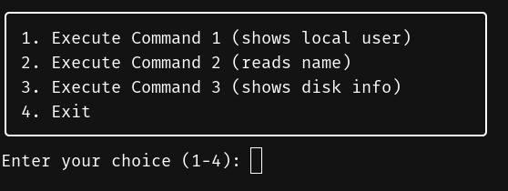
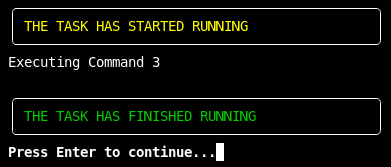
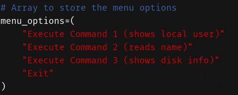

# Bash Menu Script for Linux Servers

This Bash script provides a simple interactive menu with three customizable commands and an option to exit. Each command is executed within the script, and the user is guided through the process. The script is designed with minimalism in mind, offering a condensed and clean interface for those who prefer simplicity. Additionally, colorful and formatted messages are incorporated for an enhanced user experience.

## Table of Contents
- [Features ✨](#features)
- [Installation and Usage 🚀](#installation-and-usage)
  - [Requirements 🔍](#requirements)
  - [How to Run 🏃♀️](#how-to-run)
- [Script Overview 🔍](#script-overview)
  - [Functions 🚀](#functions)
  - [Main Loop 🔄](#main-loop)
- [Customization 🛠️](#customization)
  - [ANSI Escape Codes for Text Colors 🎨](#ansi-escape-codes-for-text-colors)
- [Contributing 🤝](#contributing)
- [License 📜](#license)

## Features

- Interactive menu with numbered options
- Execution of custom commands within the script
- Colorful and formatted output for improved readability
- Easily customizable commands and functionality

## Installation and Usage

### Requirements

- Bash

### How to Run

1. Clone the repository:

   ```bash
   git clone https://github.com/jveyes/bashmenu.git
   ```
   
2. Navigate to the script directory:

    ```bash
    cd bashmenu
    ```

3. Run the script:

    ```bash
    bash script.sh
    ```

4. Follow the on-screen instructions to navigate the menu.

## Script Overview

### Functions

1. **display_menu():** Displays a formatted menu with numbered options.



2. **execute_command1():** Executes Command 1 and displays a message (example code reads your linux local username).


3. **execute_command2():** Prompts the user for a parameter, executes Command 2, and displays a message.


4. **execute_command3():** Executes Command 3 and displays a message.



### Main Loop

- The script contains a main loop that displays the menu, reads user input, and executes the corresponding function based on the choice.



## Customize

- You can customize the commands executed in `execute_command1()`, `execute_command2()`, and `execute_command3()` by adding your own commands.

### ANSI Escape Codes for Text Colors

In ANSI escape codes, you can use special sequences to add color to text in the terminal. Here's a quick reference for some common colors:

- ⚫️ **Black:** `\e[30m`
- 🔴 **Red:** `\e[31m`
- 🟢 **Green:** `\e[32m`
- 🟡 **Yellow:** `\e[33m`
- 🔵 **Blue:** `\e[34m`
- 🟣 **Magenta:** `\e[35m`
- 🔵 **Cyan:** `\e[36m`
- ⚪️ **White:** `\e[37m`

For brighter variations, you can use:

- ⚫ **Bright Black (Gray):** `\e[90m`
- 🔴 **Bright Red:** `\e[91m`
- 🟢 **Bright Green:** `\e[92m`
- 🟡 **Bright Yellow:** `\e[93m`
- 🔵 **Bright Blue:** `\e[94m`
- 🟣 **Bright Magenta:** `\e[95m`
- 🔵 **Bright Cyan:** `\e[96m`
- ⚪ **Bright White:** `\e[97m`

## Usage

To apply color to your text, use the respective escape code before your text and `\e[0m` at the end to reset the color.

Example:

```bash
echo -e "\e[91mThis text is in bright red\e[0m"
```


## Contributing

Contributions are welcome! If you find a bug or have suggestions for improvements, feel free to open an issue or submit a pull request.

## License

This project is licensed under the MIT License - see the [LICENSE](LICENSE) file for details.
